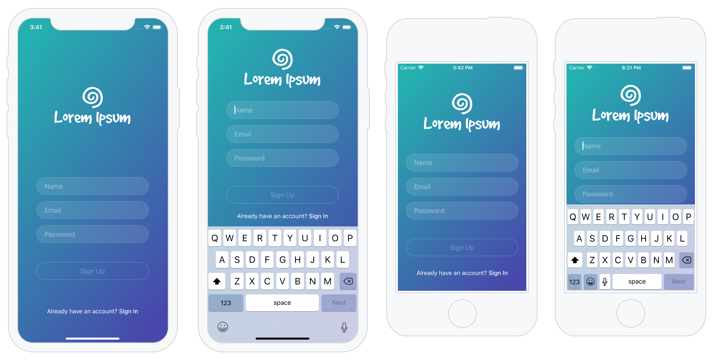
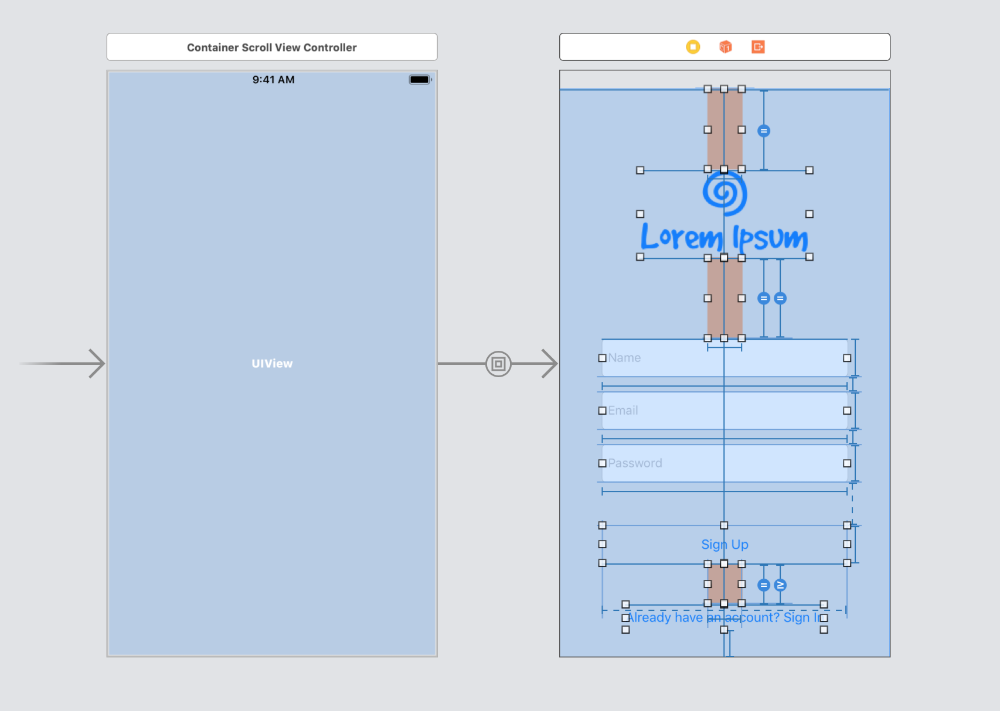
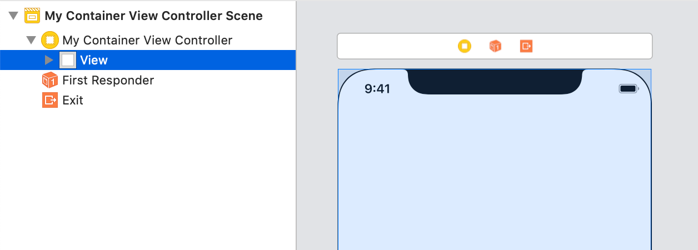
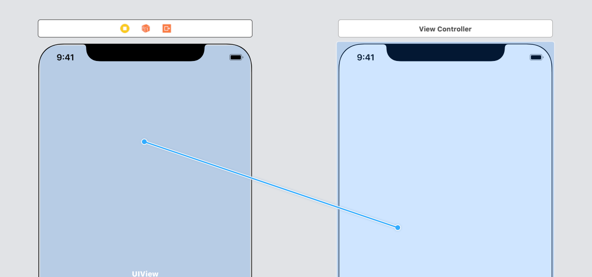
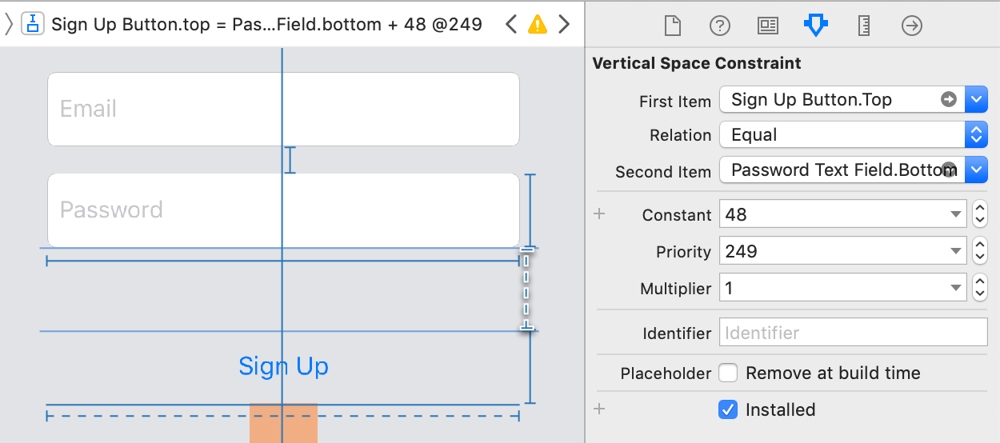
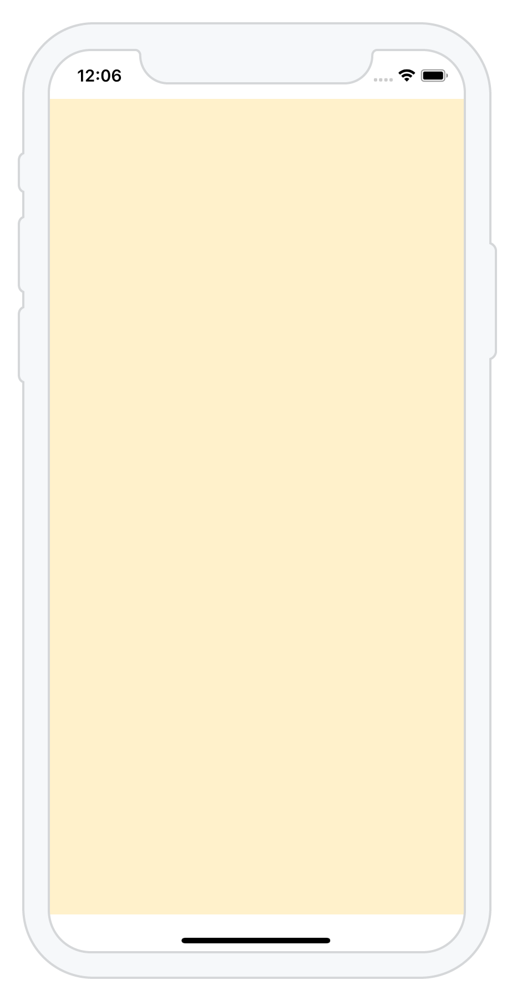

# ContainerScrollViewController

[](https://travis-ci.org/milpitas/ContainerScrollViewController)
[](http://developer.apple.com/ios)
[](https://developer.apple.com/swift)
[](https://tldrlegal.com/license/mit-license)
[](http://twitter.com/drewolbrich)

* [Purpose](#purpose)
* [Installation](#installation)
* [Usage](#usage)
* [Properties](#properties)
* [Methods](#methods)
* [Caveats](#caveats)
* [Usage Without Subclassing](#usage-without-subclassing)
* [How it Works](#how-it-works)
* [Special Cases Handled](#special-cases-handled)

## Purpose

A common UIKit Auto Layout task involves creating a view controller with a fixed layout that is too large to fit older, smaller devices, or devices in landscape orientation, or the area of the screen that remains when the keyboard is presented.

For example, consider this sign up screen, which fits iPhone XS, but not iPhone SE with a keyboard:



This case can be handled by nesting the view inside a scroll view. You can do this manually in Interface Builder, as described by Apple's [Working with Scroll Views](https://developer.apple.com/library/archive/documentation/UserExperience/Conceptual/AutolayoutPG/WorkingwithScrollViews.html) documentation, but many steps are required.

To streamline this task, ContainerScrollViewController creates the scroll view and all necessary Auto Layout constraints for you. When used in a storyboard, ContainerScrollViewController employs Interface Builder's container view feature to specify the view that should be embedded in the scroll view. The embedded view controller's contents can then be configured separately in Interface Builder.



Most importantly, ContainerScrollViewController takes care of several tricky [edge cases](#special-cases-handled) involving the keyboard and device orientation changes. 

## Installation

To install ContainerScrollViewController using CocoaPods, add the following to your Podfile:

```
pod 'ContainerScrollViewController'
```

## Usage

Subclasses of `ContainerScrollViewController` may be configured using storyboards, which makes the container view embedding relationship visible as a segue. 

You may also configure `ContainerScrollViewController` subclasses in code.

It's also possible to apply either of these approaches without subclassing, and instead use an arbitrary view controller in conjunction with the helper class `ContainerScrollViewEmbedder`. This is described below in the [Usage Without Subclassing](#usage-without-subclassing) section.     

### Storyboards

To create a container scroll view controller and its embedded view controller in a storyboard:

1. Subclass `ContainerScrollViewController`.

2. In Interface Builder, create a new view controller and set its class to your  `ContainerScrollViewController` subclass.

    

3. In the outline view, delete the new view controller's view.

    

4. Create a new container view and drag it into the view controller, replacing the view you just deleted.

    

5. Set the container view's background color to anything other than transparent, which is the default value for Interface Builder's container views. Otherwise, it will appear black.

    

That's it. You are now ready to add UI elements to the embedded view controller, as long as you ensure that the embedded view's Auto Layout constraints [adequately define its size](#auto-layout-considerations).

Optionally, if you have an existing view controller that you'd like to embed in the container view controller instead of the embedded view controller that Interface Builder created along with the container view, follow these additional steps:

6. Delete the view controller that Interface Builder created as the destination of the container view's embed segue.

    

7. Drag a new segue from the container scroll view controller to your existing view controller.

    

8. For the segue type's, choose Embed.

    

### Code

To integrate `ContainerScrollViewController` programmatically:

1. Subclass `ContainerScrollViewController`.

2. In `viewDidLoad`, call `embedViewController` with the view controller you'd like to embed in the container view controller's scroll view.

### Auto Layout Considerations

**IMPORTANT** - For ContainerScrollViewController to determine the height of the scroll view's content, the embedded view must contain an unbroken chain of constraints and views stretching from the content view’s top edge to its bottom edge. This is also true for the embedded view's width. This is consistent with the approach described by Apple's [Working with Scroll Views](https://developer.apple.com/library/archive/documentation/UserExperience/Conceptual/AutolayoutPG/WorkingwithScrollViews.html) documentation.

If you don't define sufficient Auto Layout constraints, the embedded view will not scroll correctly. 

You may see Auto Layout constraint errors in Interface Builder if the constraints don't match the simulated size of the view. The easiest way to fix this is to create at least one vertical or horizontal space constraint with a low priority (less than 250).



### Oversized Embedded View Controllers

It's possible to make the embedded view controller larger than the height of the screen, even for large devices. To do this, change the embedded view controller's simulated size to Freeform and adjust the view's size.


## Properties

### embeddedViewController

The view controller embedded in the scroll view. You may want to define a downcasting computed property for convenient access: 

```swift
var myEmbeddedViewController: MyEmbeddedViewController? {
    return embeddedViewController as? MyEmbeddedViewController
}
```

### scrollView

The scroll view within which the view is embedded. 

You may safely modify any of the scroll view's properties. for example, setting `keyboardDismissMode` to `.interactive` or `.onDrag` will dismiss the keyboard when the user drags inside the scroll view. 

### shouldResizeEmbeddedViewForKeyboard

A Boolean value that determines whether or not the embedded view is resized when the keyboard is presented.

* `true` - When the keyboard is presented, the embedded view shrinks to fit the portion of the scroll view not overlapped by the keyboard, to the extent that this is permitted by the embedded view's Auto Layout constraints. With an appropriate use of constraints, this may allow for more effective use of the reduced screen real estate. 

* `false` - When the keyboard is presented, the embedded view's size remains unchanged. This is the default value.

### shouldAdjustContainerViewForKeyboard

A Boolean value that determines whether or not the container view controller's `additionalSafeAreaInsets` property is adjusted when the keyboard is presented.

* `true` - When the keyboard is presented, the container view controller's `additionalSafeAreaInsets.bottom` property is adjusted to compensate for the portion of the scroll view that is overlapped by the keyboard, ensuring that all of the embedded view's content is accessible via scrolling. This is the default value.

* `false` - When the keyboard is presented, the container view controller's `additionalSafeAreaInsets` property remains unchanged. Use this value to implement your own keyboard presentation compensation behavior.

### shouldScrollFirstResponderToVisibleForKeyboard

A Boolean value that determines whether or not the scroll view will automatically scroll to make the first responder visible in response to keyboard changes.

* `true` - When the keyboard is presented or changes size, for example in response to a device orientation change, the scroll view scrolls to make the first responder visible. This is the default value.

* `false` - No special action is taken in response to keyboard changes. Even if this is set to `false`, UIKit may scroll the first responder to visible, although this may not work correctly in all cases. Use this value to override ContainerScrollViewController's default first responder visibility scrolling behavior.

### visibilityScrollMargin

A floating point value representing a vertical margin applied to the first responder view frame when the scroll view is automatically scrolled to make the first responder visible. The default value is 0, which matches the UIKit default behavior.

## Methods

### scrollRectToVisible(animated:margin:)

Adjusts the scroll view to make the rect visible.

The optional `margin` parameter specifies an extra margin around the rect which is also made visible. If the `margin` parameter is unspecified or `nil`, the value of `visibilityScrollMargin` will be used instead.

### scrollViewToVisible(animated:margin:)

Adjusts the scroll view to make the specified view visible.

The optional `margin` parameter specifies an extra margin around the view which is also made visible. If the `margin` parameter is unspecified or `nil`, the value of `visibilityScrollMargin` will be used instead.

### scrollFirstResponderToVisible(animated:margin:)

Adjusts the scroll view to make the first responder visible. If no first responder is defined, this method has no effect.

The optional `margin` parameter specifies an extra margin around the first responder which is also made visible. If the `margin` parameter is unspecified or `nil`, the value of `visibilityScrollMargin` will be used instead.

## Caveats

### Changing the Background Color

The embedded view is positioned within the container view's safe area. Consequently, if the embedded view's background color is set, it won't extend underneath the status bar, home indicator, navigation bar or toolbar.



To specify a background color that extends to the edges of the screen:

1. Set the background color of the container view to the desired color. The container view will be visible behind the scroll view, which has a transparent background color by default.

2. Set the embedded view's background color to transparent.

### Resizing the Embedded View

If you make changes to your embedded view that modify its size, you must call the container scroll view's `setNeedsLayout` method, or otherwise the scroll view's content size won't be updated to reflect the size change, and your view may not scroll correctly.

For example, in your embedded view controller implementation, after updating the embedded view's `NSLayoutConstraint.constant` properties, you may animate the change like this:

```swift
UIView.animate(withDuration: 0.5, delay: 0, usingSpringWithDamping: 1, initialSpringVelocity: 0, 
        options: [], animations: {
    // If we don't do this, and instead update only self.view, then the content size 
    // of the container scroll view won't change to reflect the new size of the 
    // embedded view.
    let scrollView = (self.parent as? ContainerScrollViewController)?.scrollView
    scrollView?.setNeedsLayout()
    scrollView?.layoutIfNeeded()
}, completion: nil)
```

## Usage Without Subclassing

In situations where subclassing `ContainerScrollViewController` is not an option, the helper class `ContainerScrollViewEmbedder` can be used instead:

```swift
import ContainerScrollViewController

class MyEmbeddingViewController: UIViewController {

    lazy var containerScrollViewEmbedder = ContainerScrollViewEmbedder(embeddingViewController: self)

    override func viewDidLoad() {
        super.viewDidLoad()

        containerScrollViewEmbedder.viewDidLoad()
    }

    override func prepare(for segue: UIStoryboardSegue, sender: Any?) {
        containerScrollViewEmbedder.prepare(for: segue, sender: sender)
    }

    // Note: This is only required in apps that support device orientation changes.
    override func viewWillTransition(to size: CGSize, 
            with coordinator: UIViewControllerTransitionCoordinator) {
        super.viewWillTransition(to: size, with: coordinator)

        containerScrollViewEmbedder.viewWillTransition(to: size, with: coordinator)
    }

}
```

The `ContainerScrollViewEmbedder` class supports all of the same [properties](#properties) and [methods](#methods) as `ContainerScrollViewController`.  

`ContainerScrollViewEmbedder` can also be used to embed a view controller programmatically, in which case the `viewDidLoad` and `prepare(for:sender:)` methods shown above should be omitted. Instead, provide a definition of `viewDidLoad` that calls `embedViewController` to embed the desired view controller:

```swift
import ContainerScrollViewController

class MyEmbeddingViewController: UIViewController {

    lazy var containerScrollViewEmbedder = ContainerScrollViewEmbedder(embeddingViewController: self)

    override func viewDidLoad() {
        super.viewDidLoad()

        let myEmbeddedViewController = MyEmbeddedViewController()
        containerScrollViewEmbedder.embedViewController(myEmbeddedViewController)
    }

    // Note: This is only required in apps that support device orientation changes.
    override func viewWillTransition(to size: CGSize, 
            with coordinator: UIViewControllerTransitionCoordinator) {
        super.viewWillTransition(to: size, with: coordinator)

        containerScrollViewEmbedder.viewWillTransition(to: size, with: coordinator)
    }

}
```

## How It Works

### View Controller Hierarchy

ContainerScrollViewController inserts a scroll view between the container view and its embedded view, adding layout constraints to determine the scroll view's content size.


A cleaner design for ContainerScrollViewController could directly specify `UIScrollView` as the class of the container scroll view controller's `view` property, eliminating the extra container view. However, when this was experimentally attempted in iOS 11 and 12, it resulted in the following exception:

> *** Terminating app due to uncaught exception 'NSInternalInconsistencyException', reason: 'There are unexpected subviews in the container view. Perhaps the embed segue has already fired once or a subview was added programmatically?'

This was unexpected because no container scroll view subviews were specified in Interface Builder.

Refer to [Working with Scroll Views](https://developer.apple.com/library/archive/documentation/UserExperience/Conceptual/AutolayoutPG/WorkingwithScrollViews.html) for a detailed description of how scroll views are used with Auto Layout.

### Container View

When used in a storyboard, ContainerScrollViewController requires an Interface Builder container view and its associated embed segue to define the embedding view controller relationship.

ContainerScrollViewController is able to detect the embeded view controller because UIKit calls `UIViewController.prepare(for:sender:)` for the embed segue after the container view controller is created, but before `UIViewController.viewDidLoad` is called. The embedded view controller is referenced by the embed segue's `destination` parameter.

### Additional Safe Area Insets

When the keyboard is presented, ContainerScrollViewController modifies the container view controller's `additionalSafeAreaInsets.bottom` property to reflect the area of the keyboard that overlaps the scroll view, as recommended in [Managing the Keyboard](https://developer.apple.com/library/archive/documentation/StringsTextFonts/Conceptual/TextAndWebiPhoneOS/KeyboardManagement/KeyboardManagement.html#//apple_ref/doc/uid/TP40009542-CH5-SW3).

If `additionalSafeAreaInsets.bottom` is nonzero when the keyboard is presented, it is restored to its original value when the keyboard is dismissed. This allows for the use of `additionalSafeAreaInsets` for other purposes, such as custom tool palettes.

During development, the alternate approach recommended by Apple, resizing the scroll view's content size, was also tried. However, this requires adjusting the scroll view's `scrollIndicatorInsets` property to compensate, and on iPhone X in landscape orientation, doing so has the unfortunate side effect of awkwardly shifting the scroll indicator away from the edge of the screen. Additionally, this approach appears to interact poorly with the scroll view's `scrollRectToVisible` method.

### Keyboard Resize Filtering

When a text field becomes the first responder, UIKit presents the keyboard. If the user taps on another text field, changing the first responder, UIKit may adjust the keyboard's height if an input accessory view is specified. Often, these changes will generate a sequence of `keyboardWillShow` notifications, each with different keyboard heights.

As an extreme example, if the user populates a text field by tapping on an AutoFill input accessory view, and this action causes a password text field to automatically become the first responder, one `keyboardWillHide` notifications and two `keyboardWillShow` notifications will be posted within the span of 0.1 seconds.

If ContainerScrollViewController were to respond to each of these notifications individually, this would cause awkward discontinuities in the scroll view animation that accompanies changes to the keyboard's height.

To work around this issue, ContainerScrollViewController filters out sequences of notifications that occur within a small time window, acting only on the final assigned keyboard frame in the sequence. This appears to be consistent with the way Apple's iOS apps are implemented. As of iOS 12, they seem to respond to keyboard size changes only after a short delay, and do not animate in concert with the keyboard's animation.

Refer to [Managing the Keyboard](https://developer.apple.com/library/archive/documentation/StringsTextFonts/Conceptual/TextAndWebiPhoneOS/KeyboardManagement/KeyboardManagement.html#//apple_ref/doc/uid/TP40009542-CH5-SW3) for more information about responding to changes in keyboard visibility.

## Special Cases Handled

In addition to [keyboard resize filtering](#keyboard-resize-filtering), above, ContainerScrollViewController addresses several undocumented edge cases and UIKit bugs:

### Device Orientation Changes

When the device orientation changes occur, ContainerScrollViewController improves upon the default scroll view behavior by pinning the upper left corner of the scroll view in place, while at the same time while preventing out of range content offsets.

### keyboardDismissMode Enhancement

ContainerScrollViewController automatically enables `UIScrollView.alwaysBounceVertical` when the keyboard is presented if `UIScrollView.keyboardDismissMode` is set to anything other than `.none`, so the keyboard can be dismissed even if the view is too short to normally allow scrolling.

### Arbitrary Scroll View Sizes

ContainerScrollViewController correctly handles the case when the scroll view doesn't cover the full extent of the screen, in which case it may only partially intersect the keyboard.

### Text Field Animation Artifact Fix

As of iOS 12, if the user taps on a sequence of custom text fields, UIKit may awkwardly animate the text field's text. ContainerScrollViewController suppresses this animation.     

### Scroll to Visible Fix

ContainerScrollViewController works around an issue whereby, as of iOS 12, when the orientation changes and the keyboard is visible, UIKit doesn't necessarily correctly scroll the first responder text field to make it visible, leaving the scroll view with a content offset that is out of legal range.
